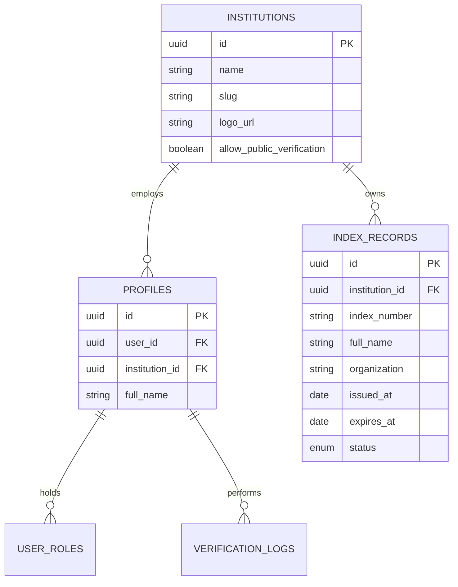

# VerifyID — Enterprise Digital Identity Verification Platform

[](https://react.dev/)
[](https://www.typescriptlang.org/)
[](https://vitejs.dev/)
[](https://tailwindcss.com/)
[](https://supabase.com/)
[](LICENSE)

**VerifyID** is an enterprise-grade digital identity verification platform engineered for educational institutions, corporate organizations, and government entities. It provides real-time verification of student and staff records, robust multi-tenant administration, comprehensive audit logging, and developer API integrations.

---

## Key Features

### 1. Real-Time Identity Lookup & Verification
- **Instant Search**: Look up records by identification number with zero-latency response.
- **Rich Verification Cards**: Displays full legal name, passport/ID photo, organization, valid date range, and status badges (*Active*, *Expired*, *Registered*).
- **Gooey Toast Alerts**: Contextual gooey morphing notifications for verification results, errors, and system state feedback.

### 2. Multi-Tenant Institution Management
- **Tenant Isolation**: Independent data management and record scope per institution.
- **Custom Branding**: Configurable institution logos, custom color schemes, and customized welcome messages.
- **Policy Controls**: Granular toggles for enforcing record expiration, requiring photo verification, and allowing public lookup.

### 3. Role-Based Access Control (RBAC) & Security
- **Triple-Tier Roles**:
  - **`super_admin`**: Platform-wide monitoring, global institution provisioning, system audit logs, and metrics.
  - **`admin`**: Institution-level record management, staff role assignment, bulk dataset imports, and branding configuration.
  - **`user`**: Verification operator access for record lookups and audit history.
- **Supabase Authentication**: Secure session management supporting Email/Password, Magic Link, and OAuth (Google & GitHub).
- **Row-Level Security (RLS)**: Enforced PostgreSQL RLS policies ensuring database-level data protection.

### 4. Metrics, Analytics & Audit Logging
- **Real-Time Dashboards**: Interactive metrics cards displaying Total Verifications, Successful Verifications, and Failed / No-Match attempts with trend charts.
- **Audit Trails**: Security logs tracking IP address, operator ID, verification timestamp, and result history.

### 5. Bulk Data Ingestion Engine
- **CSV & Excel Uploads**: Import thousands of records simultaneously with automated column mapping (`index_number`, `full_name`, `organization`, `issued_at`, `expires_at`).
- **Validation & Error Reporting**: Row-by-row pre-ingestion validation preventing duplicate entries and invalid date formats.

### 6. Developer API & Documentation Portal
- **Interactive API Docs**: Integrated documentation (`/docs`) with code examples in cURL, JavaScript, and Python.
- **Key Management**: Generation and revocation of API tokens for headless third-party system integrations.

---

## Architecture & Technology Stack

| Layer | Technology | Purpose |
| :--- | :--- | :--- |
| **Frontend Framework** | **React 18** + **TypeScript** | Component architecture & type safety |
| **Build Tool & Bundler** | **Vite 5** | Lightning-fast HMR and optimized production builds |
| **Styling & UI** | **Tailwind CSS** + **Radix UI** | Modern design system, accessible UI primitives, and glassmorphism |
| **Motion & Toast UI** | **Framer Motion** + **goey-toast** | Fluid animations, morphing state transitions, and interactive toasts |
| **Backend & Database** | **Supabase (PostgreSQL 14)** | Cloud database, Row-Level Security, Auth, and Storage |
| **Data Fetching** | **TanStack React Query v5** | Server-state management, caching, and background refetching |
| **Data Visualization** | **Recharts** | Interactive statistics graphs and analytics reporting |
| **Iconography & 3D** | **Lucide Icons** + **`<model-viewer>`** | Vector icons & interactive 3D hero assets |

---

## Directory Structure

```
.
├── src/
│   ├── components/
│   │   ├── dashboard/         # Dashboard stats grids, search lists & dialogs
│   │   ├── layout/            # Layout wrappers, headers, footers & navigation
│   │   ├── ui/                # Radix UI components (buttons, cards, dialogs, toasts)
│   │   └── BulkUpload.tsx     # CSV/Excel bulk data ingestion pipeline
│   ├── hooks/                 # Custom React hooks (use-toast, use-mobile, etc.)
│   ├── integrations/
│   │   └── supabase/          # Supabase client initialization & generated DB types
│   ├── lib/
│   │   ├── auth.tsx           # Authentication context & auth helper methods
│   │   ├── contexts/          # Institution context & multi-tenant provider
│   │   └── photo.ts           # Photo storage resolution & CDN URL builder
│   ├── pages/
│   │   ├── Activity.tsx       # System activity and verification audit log
│   │   ├── Admin.tsx          # Institution admin dashboard & record editor
│   │   ├── Auth.tsx           # User login, registration & OAuth handler
│   │   ├── Dashboard.tsx      # Home user dashboard & metric statistics
│   │   ├── Docs.tsx           # Developer API documentation & code samples
│   │   ├── Index.tsx          # Landing page & feature overview
│   │   ├── InstitutionRegister.tsx # Institution onboarding workflow
│   │   ├── InstitutionSettings.tsx # Branding, custom fields & tenant config
│   │   ├── SuperAdmin.tsx     # Global platform governance & system metrics
│   │   └── Verify.tsx         # Identity verification search portal
│   ├── App.tsx                # App routing & context provider hierarchy
│   ├── index.css              # Global CSS styles, animations & design system
│   └── main.tsx               # Application entry point
├── public/                    # Static assets, 3D models, and web manifest
├── package.json               # Dependencies and build scripts
└── vite.config.ts             # Vite build configuration & PWA setup
```

---

## Getting Started

### Prerequisites

Ensure you have the following installed on your machine:
- **Node.js**: `v18.0.0` or higher
- **npm** (or `yarn` / `pnpm` / `bun`)

### 1. Clone the Repository

```bash
git clone https://github.com/your-username/verify-id.git
cd verify-id
```

### 2. Install Dependencies

```bash
npm install
```

### 3. Configure Environment Variables

Create a `.env.local` file in the root directory and populate your Supabase credentials:

```env
VITE_SUPABASE_URL=https://your-supabase-project.supabase.co
VITE_SUPABASE_ANON_KEY=your-supabase-anon-key
```

### 4. Run the Development Server

```bash
npm run dev
```

Open [http://localhost:8080](http://localhost:8080) in your browser to view the application.

### 5. Build for Production

```bash
npm run build
```

The production-ready static bundle will be generated inside the `dist/` directory.

---

## Database Schema & RLS

The database is built on PostgreSQL via Supabase with Row Level Security enabled. Key tables include:



---

## Deployment Guide

### Deploying on Vercel

1. Push your repository to GitHub.
2. Import the repository into [Vercel](https://vercel.com).
3. Set the Environment Variables:
   - `VITE_SUPABASE_URL`
   - `VITE_SUPABASE_ANON_KEY`
4. Click **Deploy**. Vercel will automatically build and publish the Vite application.

---

## License

Distributed under the **MIT License**. See `LICENSE` for more information.
